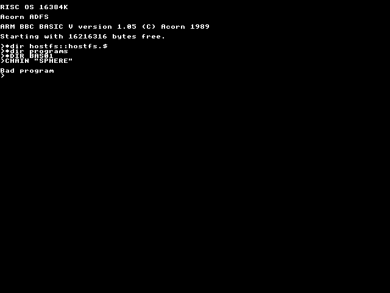
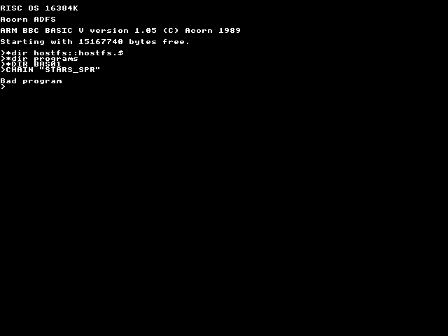
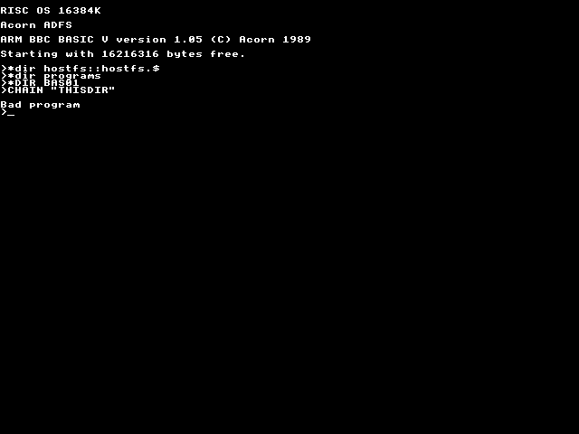

*3dbox*

*3dnavn*

*3dtxt*

*arcspark*

*badge*

*ball*

*balls2*

*bbcfg*

*borg*

*ce*

*boxes*

*celaut*

*circle2*

*crazy*

*ond*

*dirtree*

*dragon*

*dump0*

*dust2*

*dust*

*ellipser*

*ering*

*feber*

*firework*

*first*

*flake*

*flimmer*

*ginger1*

*ginger2*

*heksedan*

*hopalong*

*ild*

*kalender*

*koch*

*koral*

*letdef*

*lysavis*

*makepen*

*mandel*

*maze*

*mode12du*

*molecule*

*navn3d*

*octaeder*

*peano*

*quercus*

*radial*

*ramtrace*

*reader*

*README*

*skilt*

*sphere*

*squigg2*

*squigg3*

*squigg*

*stang2*

*stang*

*star*

*stars*

*stars_spr*

*swarm*

*texthop*

*thisdir*

*tree2*

*tree*

*triangle*

*trinet*

*ur*

*wallflow*

*waves*

