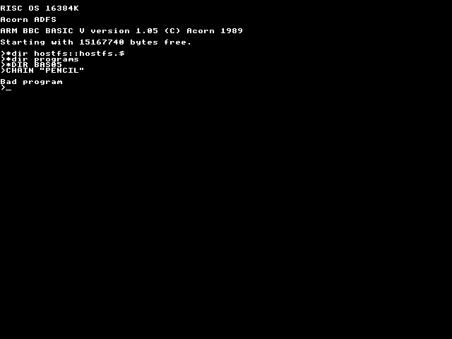
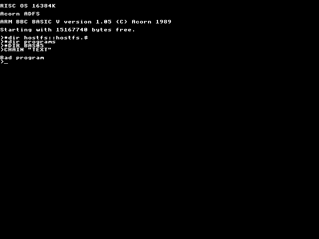

[*aiqbekar*](../../programs/BAS05/aiqbekar)

[*alientre*](../../programs/BAS05/alientre)

[*balls*](../../programs/BAS05/balls)

[*blobhunt*](../../programs/BAS05/blobhunt)

[*btest*](../../programs/BAS05/btest)

[*chess2*](../../programs/BAS05/chess2)

[*chess*](../../programs/BAS05/chess)

[*city2*](../../programs/BAS05/city2)

[*city*](../../programs/BAS05/city)

[*cloud2*](../../programs/BAS05/cloud2)

[*cloud3*](../../programs/BAS05/cloud3)

[*cloud*](../../programs/BAS05/cloud)

[*colspir*](../../programs/BAS05/colspir)

[*dage*](../../programs/BAS05/dage)

[*dump0*](../../programs/BAS05/dump0)

[*elemyg*](../../programs/BAS05/elemyg)

[*face*](../../programs/BAS05/face)

[*fern12*](../../programs/BAS05/fern12)

[*fill*](../../programs/BAS05/fill)

[*flow*](../../programs/BAS05/flow)

[*getvar*](../../programs/BAS05/getvar)

[*inbetwee*](../../programs/BAS05/inbetwee)

[*kiler*](../../programs/BAS05/kiler)

[*krans*](../../programs/BAS05/krans)

[*krukke*](../../programs/BAS05/krukke)

[*linfont*](../../programs/BAS05/linfont)

[*magic8*](../../programs/BAS05/magic8)

[*maze*](../../programs/BAS05/maze)

[*ogham*](../../programs/BAS05/ogham)

[*oldump*](../../programs/BAS05/oldump)

[*parm*](../../programs/BAS05/parm)

[*patgen*](../../programs/BAS05/patgen)

[*pencil*](../../programs/BAS05/pencil)

[*pendraw*](../../programs/BAS05/pendraw)

[*penwrite*](../../programs/BAS05/penwrite)

[*rainbow*](../../programs/BAS05/rainbow)

[*rotdice*](../../programs/BAS05/rotdice)

[*rotdraw*](../../programs/BAS05/rotdraw)

[*rotlet*](../../programs/BAS05/rotlet)

[*rotrgb*](../../programs/BAS05/rotrgb)

[*spheres1*](../../programs/BAS05/spheres1)

[*sprbounc*](../../programs/BAS05/sprbounc)

[*sprgen2*](../../programs/BAS05/sprgen2)

[*sprgen*](../../programs/BAS05/sprgen)

[*sprpen*](../../programs/BAS05/sprpen)

[*starcros*](../../programs/BAS05/starcros)

[*sticks*](../../programs/BAS05/sticks)

[*stir2*](../../programs/BAS05/stir2)

[*stir*](../../programs/BAS05/stir)

[*tarmslyn*](../../programs/BAS05/tarmslyn)

[*tern*](../../programs/BAS05/tern)

[*text*](../../programs/BAS05/text)

[*vase*](../../programs/BAS05/vase)

[*whirl*](../../programs/BAS05/whirl)

[*worms*](../../programs/BAS05/worms)

