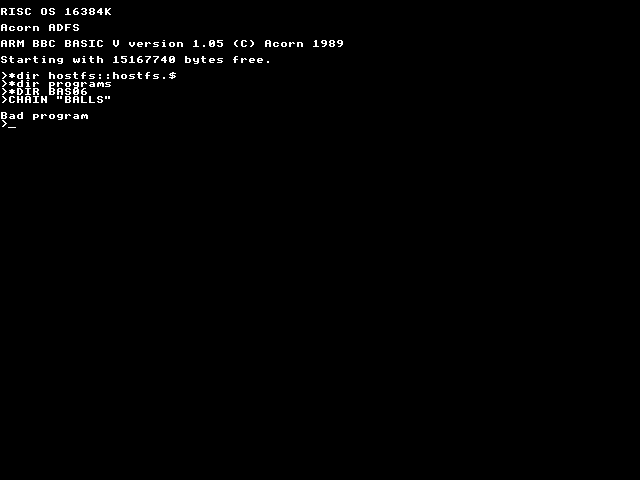

[*ball12*](../../programs/BAS06/ball12)

[*BALLS*](../../programs/BAS06/BALLS)

[*bang*](../../programs/BAS06/bang)

[*bounce*](../../programs/BAS06/bounce)

[*candy*](../../programs/BAS06/candy)

[*colourmi*](../../programs/BAS06/colourmi)

[*colshift*](../../programs/BAS06/colshift)

[*coltest*](../../programs/BAS06/coltest)

[*drawfill*](../../programs/BAS06/drawfill)

[*dtree*](../../programs/BAS06/dtree)

[*feathers*](../../programs/BAS06/feathers)

[*fillstru*](../../programs/BAS06/fillstru)

[*klee*](../../programs/BAS06/klee)

[*lines*](../../programs/BAS06/lines)

[*makeball*](../../programs/BAS06/makeball)

[*maze2*](../../programs/BAS06/maze2)

[*maze*](../../programs/BAS06/maze)

[*mtpat*](../../programs/BAS06/mtpat)

[*nbfill*](../../programs/BAS06/nbfill)

[*net*](../../programs/BAS06/net)

[*netshade*](../../programs/BAS06/netshade)

[*orbit*](../../programs/BAS06/orbit)

[*patshade*](../../programs/BAS06/patshade)

[*patterns*](../../programs/BAS06/patterns)

[*pearls2*](../../programs/BAS06/pearls2)

[*pearls3*](../../programs/BAS06/pearls3)

[*pearls4*](../../programs/BAS06/pearls4)

[*pearls*](../../programs/BAS06/pearls)

[*polygon2*](../../programs/BAS06/polygon2)

[*polygon3*](../../programs/BAS06/polygon3)

[*polygon*](../../programs/BAS06/polygon)

[*polypat*](../../programs/BAS06/polypat)

[*pulsar*](../../programs/BAS06/pulsar)

[*scale*](../../programs/BAS06/scale)

[*shade2*](../../programs/BAS06/shade2)

[*shade3*](../../programs/BAS06/shade3)

[*shade4*](../../programs/BAS06/shade4)

[*shade*](../../programs/BAS06/shade)

[*shadesta*](../../programs/BAS06/shadesta)

[*softshad*](../../programs/BAS06/softshad)

[*spheres1*](../../programs/BAS06/spheres1)

[*spheres*](../../programs/BAS06/spheres)

[*spiraltr*](../../programs/BAS06/spiraltr)

[*spray*](../../programs/BAS06/spray)

[*sprtxt2*](../../programs/BAS06/sprtxt2)

[*sprtxt3*](../../programs/BAS06/sprtxt3)

[*sprtxt*](../../programs/BAS06/sprtxt)

[*squigg6*](../../programs/BAS06/squigg6)

[*starfrac*](../../programs/BAS06/starfrac)

[*star*](../../programs/BAS06/star)

[*stars*](../../programs/BAS06/stars)

[*tentacle*](../../programs/BAS06/tentacle)

[*test*](../../programs/BAS06/test)

[*texture2*](../../programs/BAS06/texture2)

[*texture*](../../programs/BAS06/texture)

[*torus*](../../programs/BAS06/torus)

[*tracol*](../../programs/BAS06/tracol)

[*travel*](../../programs/BAS06/travel)

[*treetest*](../../programs/BAS06/treetest)

[*triangle*](../../programs/BAS06/triangle)

[*tri*](../../programs/BAS06/tri)

[*waves2*](../../programs/BAS06/waves2)

[*waves*](../../programs/BAS06/waves)

[*whirls*](../../programs/BAS06/whirls)

[*worm*](../../programs/BAS06/worm)

