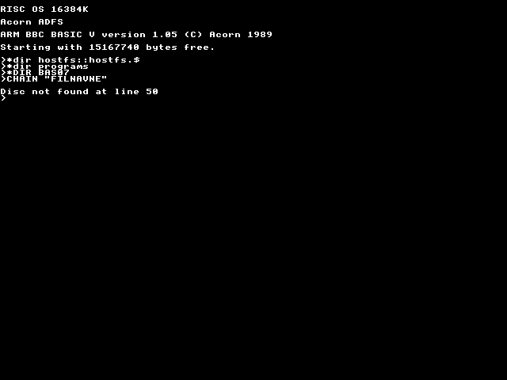
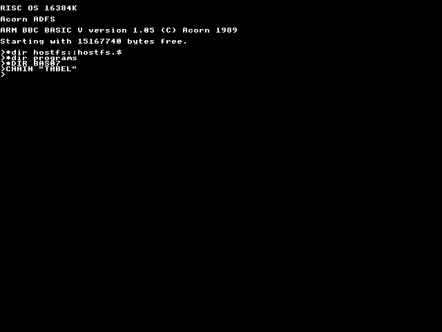

[*abstract*](../../programs/BAS07/abstract)

[*ballfill*](../../programs/BAS07/ballfill)

[*bigball*](../../programs/BAS07/bigball)

[*bounce*](../../programs/BAS07/bounce)

[*chain2*](../../programs/BAS07/chain2)

[*chain*](../../programs/BAS07/chain)

[*colballs*](../../programs/BAS07/colballs)

[*collines*](../../programs/BAS07/collines)

[*colmix*](../../programs/BAS07/colmix)

[*colony2*](../../programs/BAS07/colony2)

[*colony*](../../programs/BAS07/colony)

[*colstar*](../../programs/BAS07/colstar)

[*colstars*](../../programs/BAS07/colstars)

[*coltest*](../../programs/BAS07/coltest)

[*coltri2*](../../programs/BAS07/coltri2)

[*coltri*](../../programs/BAS07/coltri)

[*dither*](../../programs/BAS07/dither)

[*dots*](../../programs/BAS07/dots)

[*emboss2*](../../programs/BAS07/emboss2)

[*emboss*](../../programs/BAS07/emboss)

[*fatlines*](../../programs/BAS07/fatlines)

[*fill2*](../../programs/BAS07/fill2)

[*fill*](../../programs/BAS07/fill)

[*filnavne*](../../programs/BAS07/filnavne)

[*finddith*](../../programs/BAS07/finddith)

[*flake*](../../programs/BAS07/flake)

[*flies*](../../programs/BAS07/flies)

[*fract*](../../programs/BAS07/fract)

[*futhark*](../../programs/BAS07/futhark)

[*granite*](../../programs/BAS07/granite)

[*guts2*](../../programs/BAS07/guts2)

[*guts3*](../../programs/BAS07/guts3)

[*guts*](../../programs/BAS07/guts)

[*ice2*](../../programs/BAS07/ice2)

[*ice*](../../programs/BAS07/ice)

[*kalejdo2*](../../programs/BAS07/kalejdo2)

[*kalejdo*](../../programs/BAS07/kalejdo)

[*kombi*](../../programs/BAS07/kombi)

[*marblefi*](../../programs/BAS07/marblefi)

[*maze*](../../programs/BAS07/maze)

[*moire*](../../programs/BAS07/moire)

[*mold*](../../programs/BAS07/mold)

[*oneliner*](../../programs/BAS07/oneliner)

[*palette*](../../programs/BAS07/palette)

[*pat2*](../../programs/BAS07/pat2)

[*queen8*](../../programs/BAS07/queen8)

[*queens*](../../programs/BAS07/queens)

[*recpat*](../../programs/BAS07/recpat)

[*rock*](../../programs/BAS07/rock)

[*rot*](../../programs/BAS07/rot)

[*scan2*](../../programs/BAS07/scan2)

[*scan*](../../programs/BAS07/scan)

[*seaweed*](../../programs/BAS07/seaweed)

[*shatter2*](../../programs/BAS07/shatter2)

[*shatter*](../../programs/BAS07/shatter)

[*sky2*](../../programs/BAS07/sky2)

[*sky3*](../../programs/BAS07/sky3)

[*sky*](../../programs/BAS07/sky)

[*spagetti*](../../programs/BAS07/spagetti)

[*spray2*](../../programs/BAS07/spray2)

[*strange2*](../../programs/BAS07/strange2)

[*strange*](../../programs/BAS07/strange)

[*tabel*](../../programs/BAS07/tabel)

[*toner64*](../../programs/BAS07/toner64)

[*trails*](../../programs/BAS07/trails)

[*travel*](../../programs/BAS07/travel)

[*weed*](../../programs/BAS07/weed)

[*wood*](../../programs/BAS07/wood)

[*worm2*](../../programs/BAS07/worm2)

[*worm3*](../../programs/BAS07/worm3)

[*worm*](../../programs/BAS07/worm)

[*x*](../../programs/BAS07/x)

[*yarn*](../../programs/BAS07/yarn)

