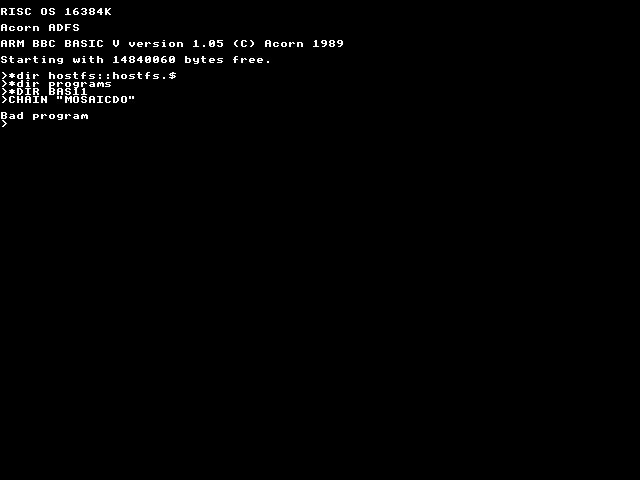

[*aliengr2*](../../programs/BAS11/aliengr2)

[*aliengra*](../../programs/BAS11/aliengra)

[*alientre*](../../programs/BAS11/alientre)

[*angle*](../../programs/BAS11/angle)

[*bubbles*](../../programs/BAS11/bubbles)

[*colint*](../../programs/BAS11/colint)

[*colpat*](../../programs/BAS11/colpat)

[*colstar*](../../programs/BAS11/colstar)

[*crunch2*](../../programs/BAS11/crunch2)

[*crunch*](../../programs/BAS11/crunch)

[*distort*](../../programs/BAS11/distort)

[*drawline*](../../programs/BAS11/drawline)

[*dstlogo2*](../../programs/BAS11/dstlogo2)

[*dstlogo*](../../programs/BAS11/dstlogo)

[*fakultet*](../../programs/BAS11/fakultet)

[*fatlines*](../../programs/BAS11/fatlines)

[*fields*](../../programs/BAS11/fields)

[*fire2*](../../programs/BAS11/fire2)

[*fire*](../../programs/BAS11/fire)

[*flamelet*](../../programs/BAS11/flamelet)

[*flower2*](../../programs/BAS11/flower2)

[*flower*](../../programs/BAS11/flower)

[*flowers*](../../programs/BAS11/flowers)

[*fonttest*](../../programs/BAS11/fonttest)

[*grid*](../../programs/BAS11/grid)

[*hypnotro*](../../programs/BAS11/hypnotro)

[*inferno*](../../programs/BAS11/inferno)

[*line*](../../programs/BAS11/line)

[*maze*](../../programs/BAS11/maze)

[*modeinfo*](../../programs/BAS11/modeinfo)

[*mosaic2*](../../programs/BAS11/mosaic2)

[*mosaic3*](../../programs/BAS11/mosaic3)

[*mosaicdo*](../../programs/BAS11/mosaicdo)

[*mosaic*](../../programs/BAS11/mosaic)

[*movlogo*](../../programs/BAS11/movlogo)

[*nova*](../../programs/BAS11/nova)

[*novascr2*](../../programs/BAS11/novascr2)

[*novascr*](../../programs/BAS11/novascr)

[*onyx*](../../programs/BAS11/onyx)

[*playback*](../../programs/BAS11/playback)

[*primlist*](../../programs/BAS11/primlist)

[*puls2*](../../programs/BAS11/puls2)

[*puls3*](../../programs/BAS11/puls3)

[*puls*](../../programs/BAS11/puls)

[*rotbounc*](../../programs/BAS11/rotbounc)

[*sparkle*](../../programs/BAS11/sparkle)

[*spiderwe*](../../programs/BAS11/spiderwe)

[*spind*](../../programs/BAS11/spind)

[*spr_rot*](../../programs/BAS11/spr_rot)

[*sqrsum*](../../programs/BAS11/sqrsum)

[*star2*](../../programs/BAS11/star2)

[*star3*](../../programs/BAS11/star3)

[*star4*](../../programs/BAS11/star4)

[*starfish*](../../programs/BAS11/starfish)

[*star*](../../programs/BAS11/star)

[*stars*](../../programs/BAS11/stars)

[*stereolo*](../../programs/BAS11/stereolo)

[*tiles*](../../programs/BAS11/tiles)

[*tilespr2*](../../programs/BAS11/tilespr2)

[*tilespr3*](../../programs/BAS11/tilespr3)

[*tilespr4*](../../programs/BAS11/tilespr4)

[*tilespr5*](../../programs/BAS11/tilespr5)

[*tilespr*](../../programs/BAS11/tilespr)

[*tunnel16*](../../programs/BAS11/tunnel16)

[*tunnel*](../../programs/BAS11/tunnel)

[*voronoi*](../../programs/BAS11/voronoi)

[*v_tile25*](../../programs/BAS11/v_tile25)

[*wild_thi*](../../programs/BAS11/wild_thi)

[*wings2*](../../programs/BAS11/wings2)

[*wings3*](../../programs/BAS11/wings3)

[*wings4*](../../programs/BAS11/wings4)

[*wings*](../../programs/BAS11/wings)

