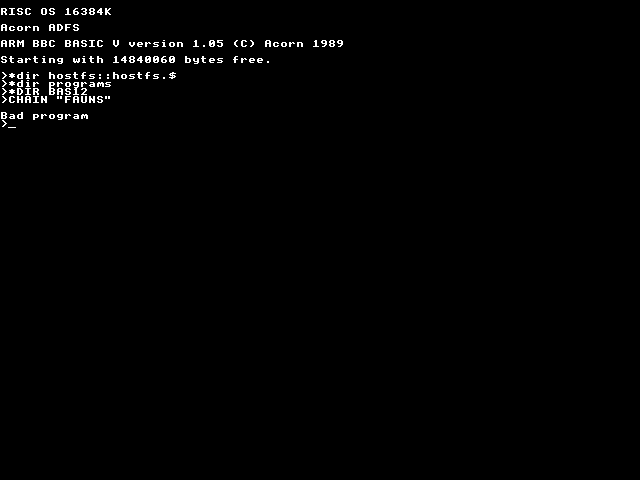
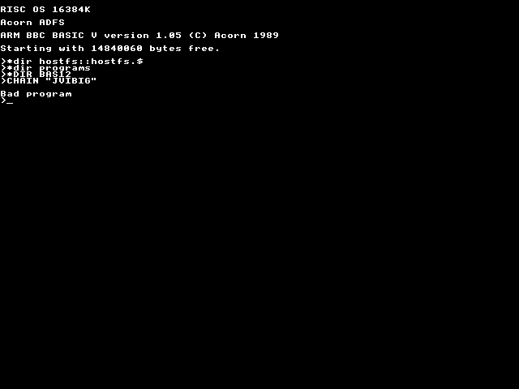
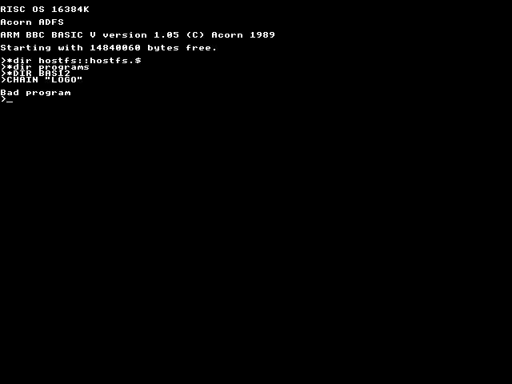

[*adddraw*](../../programs/BAS12/adddraw)

[*alientre*](../../programs/BAS12/alientre)

[*angle*](../../programs/BAS12/angle)

[*blockplo*](../../programs/BAS12/blockplo)

[*bug1*](../../programs/BAS12/bug1)

[*bug2*](../../programs/BAS12/bug2)

[*ca2*](../../programs/BAS12/ca2)

[*cards*](../../programs/BAS12/cards)

[*cells*](../../programs/BAS12/cells)

[*charfill*](../../programs/BAS12/charfill)

[*coldev2*](../../programs/BAS12/coldev2)

[*coldev3*](../../programs/BAS12/coldev3)

[*coldev*](../../programs/BAS12/coldev)

[*colprog*](../../programs/BAS12/colprog)

[*drawwood*](../../programs/BAS12/drawwood)

[*fauns*](../../programs/BAS12/fauns)

[*flag*](../../programs/BAS12/flag)

[*flare2*](../../programs/BAS12/flare2)

[*flare3*](../../programs/BAS12/flare3)

[*flare*](../../programs/BAS12/flare)

[*jvibig*](../../programs/BAS12/jvibig)

[*jvi*](../../programs/BAS12/jvi)

[*leaf2*](../../programs/BAS12/leaf2)

[*leaf3*](../../programs/BAS12/leaf3)

[*leaf*](../../programs/BAS12/leaf)

[*listfile*](../../programs/BAS12/listfile)

[*logo*](../../programs/BAS12/logo)

[*magic_5*](../../programs/BAS12/magic_5)

[*magic*](../../programs/BAS12/magic)

[*maze*](../../programs/BAS12/maze)

[*melt2*](../../programs/BAS12/melt2)

[*melt*](../../programs/BAS12/melt)

[*mode32*](../../programs/BAS12/mode32)

[*movlogo*](../../programs/BAS12/movlogo)

[*player*](../../programs/BAS12/player)

[*ringwave*](../../programs/BAS12/ringwave)

[*rotate*](../../programs/BAS12/rotate)

[*rotword*](../../programs/BAS12/rotword)

[*sand2*](../../programs/BAS12/sand2)

[*sand3*](../../programs/BAS12/sand3)

[*sand4*](../../programs/BAS12/sand4)

[*sand*](../../programs/BAS12/sand)

[*shadeplo*](../../programs/BAS12/shadeplo)

[*shatter2*](../../programs/BAS12/shatter2)

[*shatter3*](../../programs/BAS12/shatter3)

[*shatter*](../../programs/BAS12/shatter)

[*sierpins*](../../programs/BAS12/sierpins)

[*star*](../../programs/BAS12/star)

[*stereolo*](../../programs/BAS12/stereolo)

[*structur*](../../programs/BAS12/structur)

[*strukfil*](../../programs/BAS12/strukfil)

[*tern2*](../../programs/BAS12/tern2)

[*tern*](../../programs/BAS12/tern)

[*tile*](../../programs/BAS12/tile)

[*transp2*](../../programs/BAS12/transp2)

[*transp*](../../programs/BAS12/transp)

[*txtmaze2*](../../programs/BAS12/txtmaze2)

[*txtmaze*](../../programs/BAS12/txtmaze)

[*wave2*](../../programs/BAS12/wave2)

[*wave3*](../../programs/BAS12/wave3)

[*waveplot*](../../programs/BAS12/waveplot)

[*wave*](../../programs/BAS12/wave)

